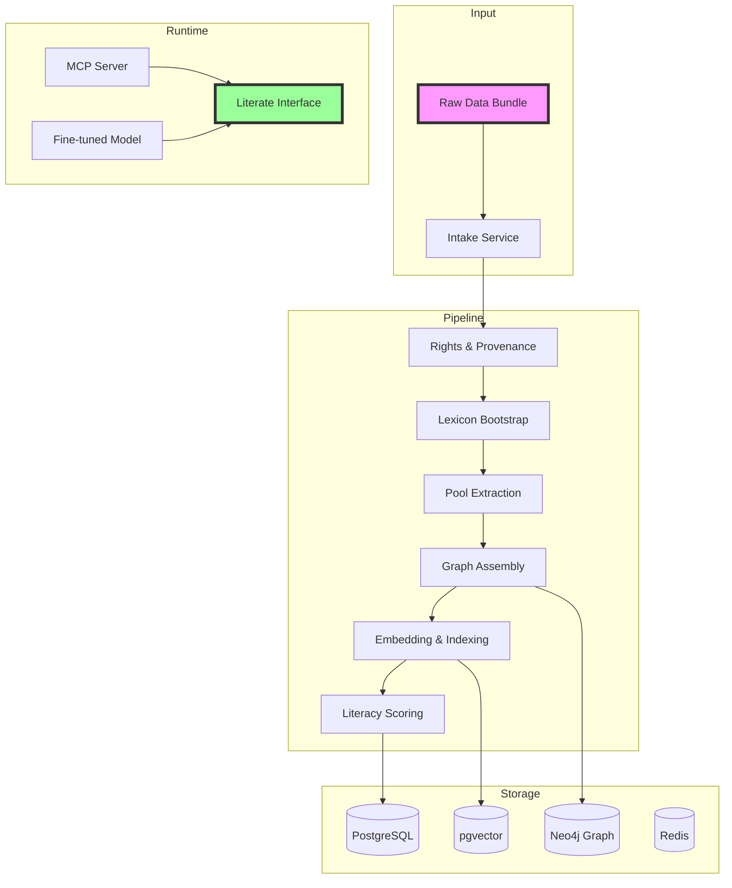
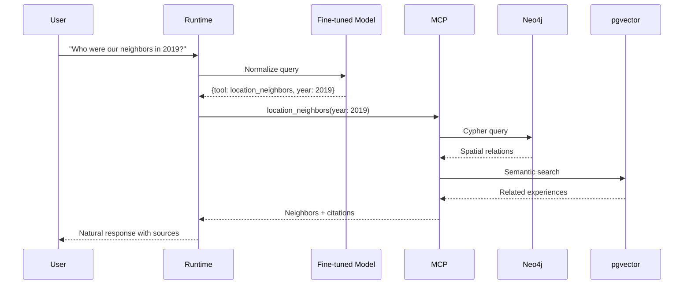

# Enliterator

Transform data collections into **literate**, conversational knowledge systems

<div class="pt-12">
  <span @click="$slidev.nav.next" class="px-2 py-1 rounded cursor-pointer" hover="bg-white bg-opacity-10">
    Zero-touch pipeline from raw data to intelligent dialogue <carbon:arrow-right class="inline"/>
  </span>
</div>

<div class="abs-br m-6 flex gap-2">
  <a href="https://github.com/yourusername/enliterator" target="_blank" alt="GitHub" title="Open in GitHub"
    class="text-xl slidev-icon-btn opacity-50 !border-none !hover:text-white">
    <carbon-logo-github />
  </a>
</div>

---
transition: fade-out
layout: intro
---

# What is Literate Technology?

Software that **converses** in natural language

<v-clicks>

- Shows its **reasoning paths** and sources
- Adapts to user **intent and constraints**
- Produces **deliverables** (not just answers)
- Treats data as a **partner in meaning**

</v-clicks>

<div v-click class="mt-8 text-sm opacity-75">
Not just retrieving data, but understanding and explaining it
</div>

---
layout: two-cols
transition: slide-up
---

# The Problem

Traditional data systems are **illiterate**

<v-clicks>

- They store but don't understand
- They retrieve but don't explain
- They answer "what" but not "why"
- They lack provenance and rights tracking
- They can't show their reasoning

</v-clicks>

::right::

# The Solution

**Enliterator** makes datasets literate

<v-clicks>

- Models data into **pools of meaning**
- Creates **explicit flows** between concepts
- Tracks **rights and provenance** everywhere
- Answers **why, how, and what's next**
- Provides a **conversational interface**

</v-clicks>

---
layout: center
class: text-center
---

# Core Concept: Enliteracy

<div class="text-4xl font-bold gradient-text mb-8">
Data → Knowledge Graph → Literate Runtime
</div>

<v-clicks>

<div class="grid grid-cols-3 gap-8 mt-12">
  <div class="card">
    <h3>📦 Raw Data</h3>
    <p>Documents, media, structured records</p>
  </div>
  <div class="card">
    <h3>🧠 Knowledge Graph</h3>
    <p>Ten Pool Canon + Relations</p>
  </div>
  <div class="card">
    <h3>💬 Literate Runtime</h3>
    <p>Natural dialogue with citations</p>
  </div>
</div>

</v-clicks>

<style>
.gradient-text {
  background: linear-gradient(45deg, #667eea 0%, #764ba2 100%);
  -webkit-background-clip: text;
  -webkit-text-fill-color: transparent;
}
.card {
  @apply p-4 rounded-lg bg-gray-100 dark:bg-gray-800;
}
</style>

---
layout: default
---

# The Ten Pool Canon

Core semantic categories for knowledge

<v-clicks>

1. **Idea** - Principles & beliefs
2. **Manifest** - Physical creations
3. **Experience** - Stories & testimony
4. **Relational** - Connections between entities
5. **Evolutionary** - Changes over time
6. **Practical** - Actions & procedures
7. **Emanation** - Inspired outputs
8. **Intent** - Goals & objectives
9. **Task** - Specific work items
10. **Spatial** - Location & geography

</v-clicks>

---
transition: slide-left
---

# Architecture Overview



---
layout: two-cols
---

# Tech Stack

**Core Framework**
- Rails 8 monolith
- Ruby 3.3+
- Solid Queue/Cache

**Data Storage**
- PostgreSQL (operational)
- Neo4j (knowledge graph)
- pgvector (embeddings)
- Redis (caching)

::right::

<br>
<br>

**AI/ML**
- OpenAI Responses API
- Structured Outputs
- Fine-tuned models
- Custom embeddings

**Interfaces**
- MCP Server protocol
- REST API
- WebSocket support

---
transition: fade
---

# Zero-Touch Pipeline

Fully automated processing from raw data to literate system

```yaml
1. Intake:
   - Discover & hash files
   - MIME type routing
   - Deduplication

2. Rights & Provenance:
   - License detection
   - Consent tracking
   - Publishing eligibility

3. Lexicon Bootstrap:
   - Canonical terms
   - Surface forms
   - Negative patterns

4. Pool Filling:
   - Entity extraction
   - Relation mapping
   - Temporal grounding
```

```yaml
5. Graph Assembly:
   - Node creation
   - Edge linking
   - Constraint enforcement

6. Embeddings:
   - Representation text
   - Path sentences
   - Semantic indexing

7. Literacy Scoring:
   - Coverage metrics
   - Flow density
   - Rights completeness

8. Deliverables:
   - Query interface
   - Evaluation bundle
   - Gap reports
```

---
layout: center
---

# OpenAI Integration

<div class="grid grid-cols-2 gap-8">

<div v-click>

## Responses API
```ruby
# Structured entity extraction
class ExtractedEntity < OpenAI::BaseModel
  required :name, String
  required :pool, OpenAI::EnumOf[
    :idea, :manifest, :experience
  ]
  required :confidence, Float
end

response = OPENAI.responses.create(
  model: "gpt-4o-2024-08-06",
  input: messages,
  text: ExtractedEntity
)
```

</div>

<div v-click>

## Fine-tuning
```ruby
# Custom model for canon understanding
client.fine_tuning.jobs.create(
  training_file: dataset_path,
  model: "gpt-mini",
  suffix: "enliterator-canon-v1"
)

# Tasks:
# - Canon mapping
# - Path narration
# - Tool routing
# - Query normalization
```

</div>

</div>

---
transition: slide-up
---

# MCP Server Tools

Model Context Protocol server with specialized tools

<div class="grid grid-cols-2 gap-4 mt-8">

<v-clicks>

<div class="tool-card">
<h3>🔍 extract_and_link</h3>
Extract & link entities from text
</div>

<div class="tool-card">
<h3>🔎 search</h3>
Semantic + graph search with rights
</div>

<div class="tool-card">
<h3>📄 fetch</h3>
Retrieve full records + relations
</div>

<div class="tool-card">
<h3>🌉 bridge</h3>
Find connections between concepts
</div>

<div class="tool-card">
<h3>📍 location_neighbors</h3>
Spatial queries and patterns
</div>

<div class="tool-card">
<h3>👤 set_persona</h3>
Style capsule management
</div>

</v-clicks>

</div>

<style>
.tool-card {
  @apply p-4 rounded-lg bg-blue-50 dark:bg-blue-900 dark:bg-opacity-20;
}
</style>

---
layout: default
---

# Literate Runtime

Natural conversation with your data

**Features:**
- Session state management
- Intent recognition
- Grounded responses
- Source citations
- Rights-aware output

**Delivery Adapters:**
- Webpage generation
- Markdown export
- PDF creation
- Timeline visualization
- Map rendering
- Voice scripts

---
transition: fade-out
---

# Example: Query Flow

<div class="flow-diagram">



</div>

---
layout: two-cols
---

# Rights & Provenance

Every piece of data tracked

<v-clicks>

- **License detection**
- **Consent management**
- **Publishing eligibility**
- **Training eligibility**
- **Rights pointers on every node**
- **Filtered retrieval**

</v-clicks>

::right::

# Quality Assurance

Comprehensive evaluation

<v-clicks>

- **Groundedness %**
- **Rights compliance**
- **Coverage metrics**
- **Retrieval quality**
- **Tool-plan accuracy**
- **Path text BLEU scores**

</v-clicks>

---
layout: center
class: text-center
---

# Performance Targets

<div class="grid grid-cols-3 gap-8 mt-12">

<div class="metric-card">
<div class="text-4xl font-bold text-blue-500">800ms</div>
<div class="text-sm mt-2">Search p95 latency</div>
</div>

<div class="metric-card">
<div class="text-4xl font-bold text-green-500">150ms</div>
<div class="text-sm mt-2">Router p95 latency</div>
</div>

<div class="metric-card">
<div class="text-4xl font-bold text-purple-500">95%</div>
<div class="text-sm mt-2">Groundedness target</div>
</div>

</div>

<style>
.metric-card {
  @apply p-6 rounded-xl bg-gray-100 dark:bg-gray-800;
}
</style>

---
transition: slide-left
---

# Development Workflow

```bash
# Initial setup
rails new enliterator --database=postgresql --css=tailwind
bundle add openai neo4j neighbor solid_queue

# Database setup
rails db:create && rails db:migrate

# Start development
bin/dev  # Rails + Solid Queue worker

# Pipeline operations
bin/rails enliterator:ingest[data/bundle.zip]
bin/rails enliterator:graph:sync
bin/rails enliterator:embed:refresh
bin/rails enliterator:fine_tune:build

# Testing
bin/rails test
bin/rails test:system
bundle exec rubocop
```

---
layout: default
---

# Key Innovations

What makes Enliterator unique

<v-clicks>

1. **Ten Pool Canon** semantic model
2. **Zero-touch pipeline** automation
3. **Rights-first** architecture
4. **Path narration** for explainability
5. **Fine-tuned canon understanding**
6. **MCP server** integration
7. **Literate deliverables** not just answers

</v-clicks>

---
layout: center
---

# Demo: Processing a Dataset

<div class="demo-steps">

<v-clicks>

### 1. Drop a data bundle
```bash
bin/rails enliterator:ingest[research_papers.zip]
```

### 2. Pipeline runs automatically
- Extracts entities and relations
- Builds knowledge graph
- Creates embeddings
- Scores literacy

### 3. Query naturally
```ruby
"What are the main themes in our research?"
"How did our focus evolve from 2020 to 2024?"
"Show me connections between AI and ethics"
```

### 4. Get literate responses
- Natural language answers
- Source citations
- Reasoning paths
- Delivery artifacts

</v-clicks>

</div>

<style>
.demo-steps {
  @apply space-y-6;
}
</style>

---
layout: two-cols
---

# Use Cases

**Research & Academia**
- Literature reviews
- Knowledge synthesis
- Citation networks
- Trend analysis

**Enterprise Knowledge**
- Document intelligence
- Process documentation
- Compliance tracking
- Institutional memory

::right::

<br>

**Content Management**
- Media archives
- Creative collections
- Rights management
- Content discovery

**Community Data**
- Event documentation
- Collective memory
- Story preservation
- Pattern recognition

---
transition: fade
---

# Evaluation Metrics

<div class="grid grid-cols-2 gap-8">

<div>

## Coverage
- Entity completeness
- Relation density
- Temporal grounding
- Spatial accuracy

## Quality
- Groundedness score
- Citation accuracy
- Path coherence
- Rights compliance

</div>

<div>

## Performance
- Query latency
- Indexing speed
- Graph traversal time
- Embedding generation

## Literacy
- Answer relevance
- Explanation clarity
- Source attribution
- Delivery fidelity

</div>

</div>

---
layout: center
class: text-center
---

# Future Directions

<div class="grid grid-cols-2 gap-8 mt-12">

<v-clicks>

<div class="future-card">
<h3>🔄 Incremental Updates</h3>
Real-time graph updates as new data arrives
</div>

<div class="future-card">
<h3>🌐 Multi-language Support</h3>
Canon and lexicon in multiple languages
</div>

<div class="future-card">
<h3>🤝 Collaborative Curation</h3>
Human-in-the-loop canon refinement
</div>

<div class="future-card">
<h3>📊 Advanced Analytics</h3>
Trend detection and predictive insights
</div>

</v-clicks>

</div>

<style>
.future-card {
  @apply p-6 rounded-xl bg-gradient-to-br from-blue-50 to-purple-50 dark:from-blue-900 dark:to-purple-900 dark:bg-opacity-20;
}
</style>

---
layout: end
class: text-center
---

# Thank You

<div class="text-2xl mb-8">
Transform your data into a literate, conversational partner
</div>

<div class="flex justify-center gap-8">
  <a href="https://github.com/yourusername/enliterator" class="btn">
    <carbon-logo-github class="inline mr-2"/> GitHub
  </a>
  <a href="mailto:contact@enliterator.io" class="btn">
    <carbon-email class="inline mr-2"/> Contact
  </a>
  <a href="https://enliterator.io/docs" class="btn">
    <carbon-document class="inline mr-2"/> Documentation
  </a>
</div>

<style>
.btn {
  @apply px-6 py-3 rounded-lg bg-gradient-to-r from-blue-500 to-purple-500 text-white font-semibold hover:scale-105 transition-transform;
}
</style>